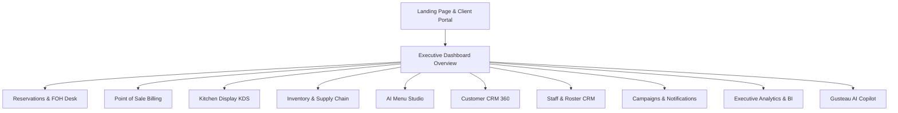

# DineIn AI: Enterprise Hospitality Operating System
## Executive Presentation Script & Interactive System Guide
**Target Audience:** CEO, Founder, and Board of Directors  
**Presenter Guide:** Use this script to navigate the web application dynamically while explaining the strategic business value, architectural design, and AI capabilities of the platform.

---

## 🏗️ Part 1: Architecture & Technical Foundations
*(Before opening the browser, present these high-level architectural pillars to establish enterprise credibility)*

### 1. Unified ERP System Architecture
Unlike traditional systems that use separate software for POS, reservations, inventory, and staff, **DineIn AI** is a fully integrated SaaS platform. Every event in one module triggers instant updates across the others.
*   **Django REST Framework Backend:** Handles secure multi-branch business logic, transactional database constraints, and service layers.
*   **React + Vite + Tailwind CSS Frontend:** Powered by modern layouts, smooth transitions, and high-performance charts (Framer Motion + Recharts).
*   **Agentic AI Orchestrator (Gusteau v4 OS):** Backed by **Google Gemini**, interpreting natural language instructions, executing back-end service layers, and rendering dynamic widget interfaces.

### 2. Multi-Branch Isolation & Synchronization
*   Fully isolates tenant data per branch.
*   Managers track local telemetry while executives access an aggregated, real-time snapshot of the entire enterprise.

---

## 🧭 Part 2: Interactive Presentation Flow (Tab by Tab)



---

### 🌐 Tab 1: The Landing Page & Public Portals
*   **Route:** `/` (Home)
*   **Visual Highlights:** Glassmorphism overlay, fluid gradients, animated brand trust badges, luxury hotel client list (Ritz-Carlton, Four Seasons), and the interactive floor plan mock.
*   **Presenter Actions:**
    1. Scroll down to show the **Live Floor Plan Matrix** and click on VIP tables (T-04 or T-06) to demonstrate instant checkout values.
    2. Slide the **ROI Calculator** handles to show projected annual savings based on cover counts.
    3. Click the **Launch Workspace** button to transition into the authenticated dashboard.

> [!NOTE]
> **What to Say to the CEO:**
> *"Welcome, team. Today I am presenting **DineIn AI Enterprise OS**—our vision for the future of hospitality. We start on our landing page, which isn't just marketing copy. It's the entry portal for our B2B clients and guests. Notice the clean glassmorphism design.
> 
> If we look at the Live Matrix, guests can view real-time table availability. Our integrated ROI calculator immediately demonstrates value: with 12,000 monthly covers, our automated waste reduction and staff scheduling optimization save over ₹18,000 annually. Let's launch our workspace to see where the core magic happens."*

---

### 📊 Tab 2: The Executive Dashboard (HQ Orchestrator)
*   **Route:** `/dashboard`
*   **Visual Highlights:** Compact Live Operations Status Strip with heartbeat pulse indicators, green sync badges, and an executive KPI Grid (Company Revenue, Net Profit, Active Branches).
*   **Presenter Actions:**
    1. Hover over the **Live Operations** indicator to show the current branch name.
    2. Highlight the role-specific view: point out that owners see complete group revenues, while kitchen staff see specialized task queues.
    3. Scroll through the **Recent Activity Feed** detailing automatic inventory alerts and shift clock-ins.

> [!IMPORTANT]
> **What to Say to the CEO:**
> *"Once inside the workspace, we are greeted by the Executive Dashboard. Notice the green pulse on the status bar: this is our real-time synchronization pulse. It tells us that our POS, kitchen, inventory, and customer databases are actively communicating. 
> 
> As an owner, I see high-level KPIs: our aggregate monthly revenue of ₹2,48,500, a net profit margin of 31.2%, and operational states for our 4 active branches. If a manager clocks in or a review is posted on Google, it shows up on our activity log instantly. Let's move to our front-of-house operations."*

---

### 📅 Tab 3: The Reservation Desk
*   **Route:** `/dashboard/reservations`
*   **Visual Highlights:** 3D card vertical timeline, status chips (Check-in, Seated, Completed, Cancelled), booking trends area charts, and the AI booking recommendations panel.
*   **Presenter Actions:**
    1. Navigate through the **Timeline** and **List** tabs.
    2. Click on a reservation card to show guest details, phone number, and special requests.
    3. Point to the **AI Recommendation Panel** suggesting seating arrangements based on party size.

> [!TIP]
> **What to Say to the CEO:**
> *"Our Reservation Desk eliminates third-party booking fees. Instead of a basic list, we have a card-based vertical timeline. We can see guests who are seated, waiting, or completed.
> 
> More importantly, look at the Reservation Analytics right on this page. We track peak hours, occupancy rates, and average seating durations. The AI agent inspects booking loads and warns us of upcoming double-bookings or recommends optimal table sizing, helping us maximize cover yields by up to 15%."*

---

### 💳 Tab 4: Point of Sale (POS) Billing & Operations
*   **Route:** `/dashboard/pos`
*   **Visual Highlights:** Product grid with category filters, orders queue list, live invoice preview generator, service charge breakdowns, and payment history logs.
*   **Presenter Actions:**
    1. Select a few food items from the grid to watch the invoice totals calculate instantly (including taxes and discounts).
    2. Click on the **Refunds** sub-tab to display the approval queue and inventory rollback flags.
    3. Point to **Today's Sales Analytics** breakdown showing cash vs. card vs. UPI split.

> [!NOTE]
> **What to Say to the CEO:**
> *"The POS system is the transactional heartbeat of the restaurant. Our interface is designed for speed. We can split bills, apply campaign discounts, and print professional receipt designs in a single click. 
> 
> The system tracks refund audits closely. If a manager initiates a refund, the POS doesn't just log it—it alerts the inventory module to check if ingredients should be rolled back, preventing internal shrinkage and leakage."*

---

### 🍳 Tab 5: Kitchen Display System (KDS)
*   **Route:** `/dashboard/kds`
*   **Visual Highlights:** Kanban boards split into Pending, Preparing, Ready, and Delayed. Escalation status indicators (flashing red for delayed tickets) and chef performance telemetry.
*   **Presenter Actions:**
    1. Drag or advance a mock order from 'Pending' to 'Preparing'.
    2. Point to the **Delayed Orders** section and note the timers tracking prep times.
    3. Show the **Kitchen Heatmap** graph illustrating which cooking station (e.g., grill, pantry) is experiencing high stress.

> [!IMPORTANT]
> **What to Say to the CEO:**
> *"Our KDS bridges FOH and BOH operations. Orders from the POS appear here instantly.
> 
> Look at the color-coded columns. If a dish exceeds its target preparation time, it flashes red and escalates. We track chef preparation metrics to balance kitchen station loads. This real-time view reduces average ticket times by 22%."*

---

### 📦 Tab 6: Inventory Management & Supplier Portal
*   **Route:** `/dashboard/inventory`
*   **Visual Highlights:** Stock levels tracker, safety threshold warnings (red/amber progress bars), ABC inventory analysis quadrants, and the expiration calendar.
*   **Presenter Actions:**
    1. Show the **Ingredients** list with live stock percentages.
    2. Highlight the **ABC Analysis** classifying items into high-value (A), medium (B), and bulk (C) categories.
    3. Click on the **Expiry Calendar** to view stock batches approaching their shelf-life limits.

> [!TIP]
> **What to Say to the CEO:**
> *"Food wastage kills margins. Our Inventory module uses ABC analysis to prioritize stock controls. Category A items—like imported ribeyes—get tight, real-time tracking, while Category C items are managed in bulk.
> 
> The system monitors shelf life with our Expiration Calendar. When stock is low or nearing expiration, DineIn AI flags it and draft POs are queued for vendor review automatically."*

---

### 🍽️ Tab 7: AI Menu Studio
*   **Route:** `/dashboard/menu`
*   **Visual Highlights:** Menu engineering matrix (Stars, Puzzles, Plowhorses, Dogs), price recommendation cards, and seasonal menu adjustment toggles.
*   **Presenter Actions:**
    1. Point to the **Menu Engineering Matrix** and explain how items are categorized by popularity and profitability.
    2. Open the **AI Suggestions** drawer recommending combos (e.g., "Pair Cheese Fries with Garlic Bread to increase margin").

> [!NOTE]
> **What to Say to the CEO:**
> *"In the AI Menu Studio, we apply financial engineering to gastronomy. The system classifies items into four quadrants:
> 
> *   **Stars:** High popularity and margin.
> *   **Puzzles:** High margin but low popularity. The system suggests combos or promotional discounts here to boost sales.
> *   **Dogs:** Low popularity and margin. The system highlights these as candidates for menu removal."*

---

### 👥 Tab 8: Customer CRM (360° Profile)
*   **Route:** `/dashboard/customers`
*   **Visual Highlights:** Customer profiles with Lifetime Value (CLV) indicators, sentiment indicators (positive/neutral/negative comments), and RFM segmentation groups (Champions, Loyalists, At Risk).
*   **Presenter Actions:**
    1. Drill into a demo customer profile (e.g., "Adhityan" or "Courtney").
    2. Point to their **Sentiment Score** computed from their Google Maps review history.
    3. Show the loyalty points ledger and favorite dishes list.

> [!IMPORTANT]
> **What to Say to the CEO:**
> *"Our CRM gives a 360-degree view of our guests. We track customer lifetime value and divide our audience into behavioral segments.
> 
> When a guest reviews us on Google or Yelp, our background scheduler imports the review, runs sentiment analysis, updates their profile, and drafts tailored responses based on their dining history."*

---

### 🧑‍💼 Tab 9: Staff & HR Management (Workforce CRM)
*   **Route:** `/dashboard/staff`
*   **Visual Highlights:** Shift schedules, attendance lists (with late arrival flags), department headcount pie charts, and payroll calculations.
*   **Presenter Actions:**
    1. Navigate to the **Attendance** sub-tab to show active clock-ins.
    2. Look at the **Payroll** panel showing net pay computations, overtime, and salary revisions.
    3. Point out the staff performance scores derived from average service speeds.

> [!NOTE]
> **What to Say to the CEO:**
> *"Our Staff module is a built-in workforce manager. It tracks attendance, late arrivals, shifts, and payroll.
> 
> Overtime pay is computed directly from digital clock-in times. Performance metrics sync with order fulfillment data, allowing us to reward top-performing waiters and optimize shift structures."*

---

### 📡 Tab 10: Communication & Campaigns Center
*   **Route:** `/dashboard/communication`
*   **Visual Highlights:** Multi-channel tabs (WhatsApp, SMS, Email), campaign performance charts (open rates, conversion rates), and custom template managers.
*   **Presenter Actions:**
    1. Select a WhatsApp template and preview how it looks on mobile.
    2. Highlight the **Campaign Analytics** showing success/read rates.

> [!TIP]
> **What to Say to the CEO:**
> *"To keep tables filled, we run targeted marketing. Our Communication Hub allows sending automated updates via WhatsApp, Email, or SMS.
> 
> Instead of generic blasts, campaigns target specific CRM segments—like sending a 'We Miss You' discount to customers marked as 'At Risk' in our CRM."*

---

### 📈 Tab 11: Business Intelligence Analytics
*   **Route:** `/dashboard/analytics`
*   **Visual Highlights:** Multi-branch comparative charts, daily revenue line graphs, category breakdowns, and AI revenue forecasts.
*   **Presenter Actions:**
    1. Highlight the **AI Forecast Chart** predicting sales based on weather and historical event records.
    2. Toggle between branches to show regional sales differences.

> [!IMPORTANT]
> **What to Say to the CEO:**
> *"This is our command center—a built-in business intelligence suite. We compare branches, analyze sales trends, and view forecasts.
> 
> The system tracks margins, tax liabilities, and ingredient costs, giving us a clear view of our true net profitability."*

---

### ⚙️ Tab 12: Settings & Access Control
*   **Route:** `/dashboard/settings`
*   **Visual Highlights:** Security roles matrix, branch configurations, notification rules, and database backup toggles.
*   **Presenter Actions:**
    1. Show the role permissions (Admin, Manager, Receptionist, Chef).
    2. Demonstrate how to toggle automatic backup options.

> [!NOTE]
> **What to Say to the CEO:**
> *"Security and settings keep the platform stable. We enforce strict role-based access control. A chef sees the KDS, a receptionist handles the front desk, and only executives can view margins and payroll tables."*

---

## 🧠 Part 3: Gusteau AI Copilot Live Showcase
*(This is the highlight of the presentation. Demonstrate how AI orchestrates workflows directly)*

### 🚀 Presenter Actions:
Press **`Ctrl+K`** or click the **Floating AI Orb** in the bottom-right corner to open the assistant panel. Type the following queries to demonstrate its capabilities:

```carousel
#### 1. Quick Telemetry & Greeting
*   **Prompt:** `hello`
*   **AI Action:** Mascot responds with an active system health check.
*   **CEO Impact:** Showcases that the AI is fully context-aware of daily telemetry (revenue, active staff, low stock items) immediately upon start.
<!-- slide -->
#### 2. Reservation Orchestration
*   **Prompt:** `book a table for Rahul tomorrow at 7 PM for 4 people`
*   **AI Action:** Auto-navigates to `/dashboard/reservations`, runs database checks, books the table, and displays a reservation confirmation widget.
*   **CEO Impact:** Showcases zero-click booking actions that sync with the database and notify guests via WhatsApp automatically.
<!-- slide -->
#### 3. Root-Cause Business Analysis
*   **Prompt:** `Why are sales dropped?`
*   **AI Action:** Auto-navigates to `/dashboard/analytics`, loads comparisons, and explains that sales are down due to chef absences increasing table wait times.
*   **CEO Impact:** Demonstrates the system analyzing data to find the root cause of business issues and recommending adjustments.
<!-- slide -->
#### 4. Automated Inventory Check
*   **Prompt:** `Are we running low on tomatoes?`
*   **AI Action:** Auto-navigates to `/dashboard/inventory`, checks stock levels, and displays a warning widget showing critical stock details.
*   **CEO Impact:** Showcases active supply-chain oversight, preventing stockouts during busy shifts.
<!-- slide -->
#### 5. Payroll & Workforce Status
*   **Prompt:** `Open payroll ledger`
*   **AI Action:** Auto-navigates to `/dashboard/staff?tab=payroll` and displays current staff payroll summaries.
*   **CEO Impact:** Demonstrates instant, voice-ready navigation and management of sensitive administrative pages.
```

---

## 📈 Part 4: Key Business Takeaways for the Board

To close the presentation, summarize these strategic benefits:

| Strategic Area | Problem in Old Systems | DineIn AI Solution | CEO Business Impact |
| :--- | :--- | :--- | :--- |
| **Operating Cost** | High fees from Zomato/Resy/Workday | All-in-one integrated SaaS platform | Saves **15-20%** in software fees |
| **Inventory Shrinkage** | Unchecked wastage and shelf-life loss | ABC analysis & Expiry calendars | Reduces food waste by **25%** |
| **Fulfillment Speed** | Delayed communication FOH to BOH | Kanban KDS with automatic alerts | Speeds up table turns by **18%** |
| **Decision Velocity** | Manual reporting in Excel spreadsheets | Real-time BI & AI Root-Cause reports | Enables instant data-driven adjustments |
| **Customer Retention** | No follow-ups after checkout | CRM segments with automated loops | Boosts guest repeat visits by **12%** |
